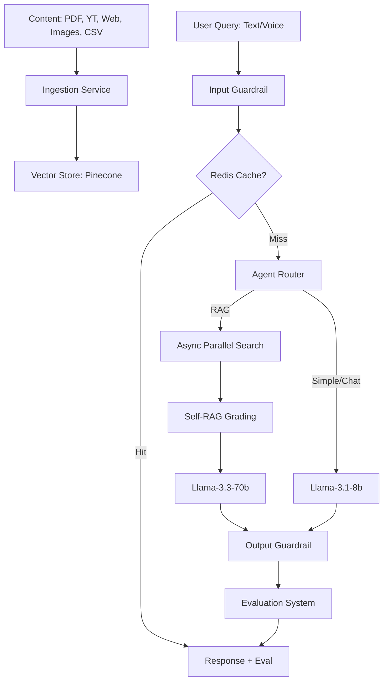

# AI Second Brain 🧠

**Your Production-Grade Multimodal Agentic Knowledge Assistant**

## Live Demo
Access the deployed application here: [https://ai-second-brain-rag.streamlit.app/](https://ai-second-brain-rag.streamlit.app/)

**Note:** The backend is hosted on Render's free tier, which may go into sleep mode after inactivity. If the app fails to connect, please visit the [Backend URL](https://ai-second-brain-o8nj.onrender.com) once to wake it up.

---

## 🚀 Overview
**AI Second Brain** is a production-grade Retrieval-Augmented Generation (RAG) system designed to act as your external digital memory. It transforms raw data—PDFs, YouTube videos, images, web articles, and CSVs—into a searchable, conversational knowledge base.

Recently upgraded to a **Service-Oriented Architecture (SOA)**, the system now features ultra-fast inference, intelligent model routing, and built-in security guardrails to ensure reliability and performance at scale.

---

## ✨ Key Features

- **📂 Multimodal Ingestion**:
  - **PDF & Web**: Full-text indexing for documents and web articles.
  - **YouTube Transcripts**: Automatic extraction and indexing from video URLs.
  - **Vision & OCR**: Image analysis and text extraction via `Llama-4-Scout`.
  - **Voice Intelligence**: Speech-to-Text (Whisper) and Text-to-Speech output.
  - **AI Data Analyst**: Natural language querying for CSV files using Pandas.

- **🤖 Advanced Agentic Orchestration**:
  - **Intelligent Router**: Automatically directs queries to Vector Search, Data Analyst, or Direct Chat.
  - **Dynamic Model Routing**: Optimizes cost and speed by using `Llama-3.1-8b` for simple tasks and `Llama-3.3-70b` for complex reasoning.
  - **Self-RAG (Reflection)**: Autonomously grades retrieved context for relevance to eliminate hallucinations.

- **⚡ Performance & Reliability**:
  - **Redis Caching**: Instant response times for repeated queries via distributed caching.
  - **Async Pipelines**: Parallelized processing for retrieval and relevance checks using `asyncio`.
  - **Retry & Fallback**: Automatic exponential backoff and secondary model fallback for 99.9% uptime.

- **🛡️ Trust & Observability**:
  - **Guardrails**: Built-in detection for prompt injections and faithfulness grounding checks.
  - **Real-time Eval Scores**: Every response is auto-scored for *Relevance* and *Faithfulness*.
  - **Live Activity Logs**: Monitor agent routes, model latency, and cache hits in the UI.
  - **Source Attribution**: Transparent referencing of original data sources for every answer.

---

## 🏗️ Architecture



---

## 🛠️ Tech Stack
- **Frontend**: [Streamlit](https://streamlit.io/) (Rich UI with real-time streaming)
- **Backend**: [FastAPI](https://fastapi.tiangolo.com/) (Async Service-Oriented Architecture)
- **Orchestrator**: Custom Async Pipeline (`orchestrator.py`)
- **Vector DB**: [Pinecone](https://www.pinecone.io/) (Serverless)
- **Caching**: [Redis](https://redis.io/) (Distributed Caching)
- **LLM Engine**: [Groq](https://groq.com/) (LPU™ Inference)
- **Models**: Llama-3.3-70b, Llama-3.1-8b, Llama-4-Scout-17b, Whisper-v3

---

## 🔑 Environment Variables
| Variable | Description |
| :--- | :--- |
| `GROQ_API_KEY` | For high-speed LLM inference |
| `PINECONE_API_KEY` | For persistent vector database |
| `REDIS_URL` | Redis connection string (e.g., `redis://:pwd@host:port`) |
| `HF_TOKEN` | For Hugging Face Inference API (embeddings) |
| `OPENAI_API_BASE` | `https://api.groq.com/openai/v1` |
| `API_URL` | Backend URL (Local: `http://localhost:8000`) |

---

## 💻 Installation & Setup

1. **Clone & Install**:
   ```bash
   git clone https://github.com/Hartz-byte/AI-Second-Brain.git
   pip install -r requirements.txt
   ```

2. **Run Services**:
   ```bash
   # Terminal 1: Backend
   uvicorn backend.main:app --reload
   
   # Terminal 2: Frontend
   streamlit run frontend/app.py
   ```

---

## ⭐️ Support the Project
If you find this project useful, please give it a star on [GitHub](https://github.com/Hartz-byte/AI-Second-Brain)!
