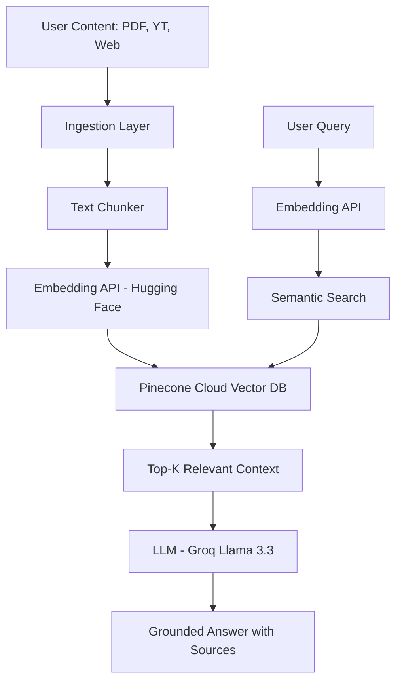

# AI Second Brain 🧠 

**Your Personal AI-Powered Knowledge Assistant**

[](https://ai-second-brain-rag.streamlit.app/)

## 🚀 Live Demo
Access the deployed application here: [https://ai-second-brain-rag.streamlit.app/](https://ai-second-brain-rag.streamlit.app/)

---

## 📖 Overview
**AI Second Brain** is a Retrieval-Augmented Generation (RAG) system designed to act as your external digital memory. It allows you to ingest vast amounts of information from multiple sources—PDFs, YouTube videos, web articles, and direct text—and then chat with that knowledge using state-of-the-art LLMs. 

Unlike traditional search, AI Second Brain understands context, tracks sources, and provides grounded answers derived specifically from your personal data pool.

---

## ✨ Features
- 📂 **Multi-Source Ingestion**:
  - **PDF Parser**: Extract text from documents using `PyPDF2`.
  - **YouTube Transcript**: Automatically fetch and index transcripts from video IDs/URLs.
  - **Web Scraper**: Cleanly extract article content from URLs using `BeautifulSoup`.
  - **Direct Paste**: Quickly add snippets of text or notes.
- 🔍 **Cloud Vector Database**: Uses **Pinecone Serverless** for high-speed, persistent vector storage (no data loss on server restarts).
- 🧠 **Hybrid Retrieval**: Combines semantic vector search (Dense) with keyword-based ranking (Sparse) for maximum accuracy.
- ⚡ **Lightning Fast Responses**: Powered by **Groq API** with `Llama-3.3-70b`, delivering near-instant inference.
- ☁️ **Lightweight Deployment**: Optimized for Free Tier hosting (Render & Streamlit) by offloading heavy ML processing to **Hugging Face Inference APIs**.
- 🛠️ **Source Attribution**: Every answer generated include references to the original source (e.g., *Source: YouTube Video - ID*) to ensure transparency.

---

## 🏗️ Architecture



---

## 🛠️ Tech Stack
- **Frontend**: [Streamlit](https://streamlit.io/) (Clean, interactive UI)
- **Backend**: [FastAPI](https://fastapi.tiangolo.com/) (High-performance API layer)
- **Vector DB**: [Pinecone](https://www.pinecone.io/) (Serverless vector storage)
- **Embeddings**: `all-MiniLM-L6-v2` via **Hugging Face Inference Router**
- **LLM Engine**: [Groq](https://groq.com/) (**Llama 3.3 70B**)
- **Deployment**: [Render](https://render.com/) (Backend) & [Streamlit Cloud](https://share.streamlit.io/) (Frontend)

---

## ⚙️ Environment Variables
To run this project, you need the following keys in your `.env` file or cloud secrets:

| Variable | Description | Source |
| :--- | :--- | :--- |
| `GROQ_API_KEY` | For LLM Inference | [Groq Console](https://console.groq.com/) |
| `PINECONE_API_KEY` | For Vector Database | [Pinecone Console](https://app.pinecone.io/) |
| `HF_TOKEN` | For Embedding API | [Hugging Face Settings](https://huggingface.co/settings/tokens) |
| `OPENAI_API_BASE` | `https://api.groq.com/openai/v1` | Groq's OpenAI-compatible endpoint |
| `API_URL` | Your Backend URL | Provided by Render after deployment |

---

## 🛠️ Installation & Local Setup

1. **Clone the repository**:
   ```bash
   git clone https://github.com/Hartz-byte/AI-Second-Brain.git
   cd AI-Second-Brain
   ```

2. **Create a Virtual Environment**:
   ```bash
   python -m venv venv
   source venv/bin/activate  # Windows: venv\Scripts\activate
   ```

3. **Install Dependencies**:
   ```bash
   pip install -r requirements.txt
   ```

4. **Run the Backend**:
   ```bash
   uvicorn backend.main:app --reload
   ```

5. **Run the Frontend**:
   ```bash
   streamlit run frontend/app.py
   ```

---

## 📜 Deployment

### Backend (Render)
- Deploy as a **Web Service**.
- Select Python 3.11.
- Add all environment variables to the **Environment** tab.
- **Start Command**: `uvicorn backend.main:app --host 0.0.0.0 --port $PORT`

### Frontend (Streamlit Cloud)
- Connect your GitHub repo.
- Point to `frontend/app.py` as the main file.
- Add `API_URL`, `GROQ_API_KEY`, `PINECONE_API_KEY`, etc., to the **Secrets** tab in TOML format.

---

## 🤝 Contributing
Contributions are welcome! Please feel free to submit a Pull Request.

## 📄 License
This project is licensed under the MIT License - see the LICENSE file for details.